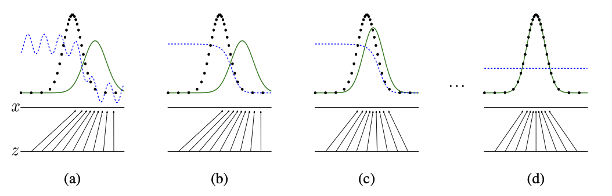
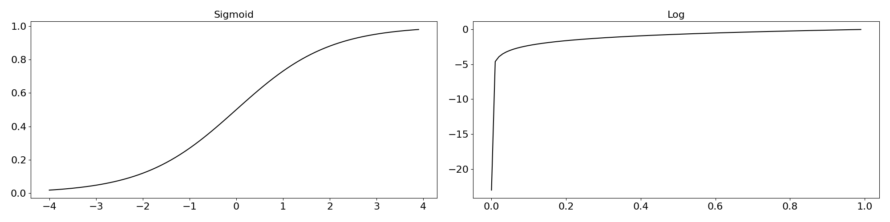

Github Markdown 엔진은 LaTex을 지원하지 않기 때문에 [PDF](./src/README.md) 를 다운로드하길 바랍니다. 

# GAN (Generative Adversarial Network)
$$ \underset{G}{min}\underset{D}{max} \ V(D,G) = \mathbb{E}_{x \sim p_{data(x)}}\Big[logD(x)\Big] + \mathbb{E}_{z \sim p_Z(z)}\Big[log \Big(1-D\big(G(z)\big)\Big)\Big]) $$

Ian Goodfellow가 처음 제안했던 GAN은 생성자($G$), 분류자($D$)두 모델 간의 경쟁하면서 생성자 모델의 데이터 생성 능력을 개선한다. 생성자는 분류자가 진짜(1)로 인식하게끔 학습이 이루어지고 분류자는 실제데이터는 진짜(1)로 인식하며 생성자에서 생성되는 이미지는 가짜로 인식하게끔 학습이 이루어진다.



학습 초기(a)에는 생성되는 분포(초록)와 실제 데이터의 분포(검정)같이 차이가 발생하게 되지만 학습이 반복됨에 따라 실제 데이터 분포와 유사한 데이터를 생성한다. 최종적(d)으로는 분류자 관점에서 생성데이터 인지 분류할 수 없도록 하는 것을 목표로 한다. 따라서 GAN의 목적은 입력데이터 분포와 같은 분포의 데이터를 생성하는 생성자를 학습하는 것을 목표로 한다.


## LOSS 
---
GAN 학습에 사용되는 loss($V(D,G)$)는 아래와 같다. loss는 2개의 텀을 가지고 있는데 왼쪽을 보게 되면 $V(D,G)$에서 $G$는 최소, $D$는 최대가 되도록 한다는 정의를 하고 있다. 실제 구현에서는 다른 방식으로 loss를 구현하게 되지만 여기서는 해상 수식으로 먼저 설명하려 한다. 

$$ \underset{G}{min}\underset{D}{max} \ V(D,G) = \mathbb{E}_{x \sim p_{data(x)}}\Big[logD(x)\Big] + \mathbb{E}_{z \sim p_Z(z)}\Big[log \Big(1-D\big(G(z)\big)\Big)\Big]  $$
$$ G:Generator(생성자), D: Discriminator(분류자), x: Real Data, z: noise $$

먼저 $D$의 관점에서 수식을 생각해본다. D의 최종출력은 sigmoid를 사용함으로 0에서 1 사이의 출력으로 고정되게 된다. 그리고 $log(0)$은 $-\infty$ 이고 $log(1)$은 0이다. 그렇다면 아래의 수식이 최대가 되는 경우는 두 항 모두 0이 되어야 하므로 실제 데이터에 대한 분류자의 확률 $D(x)$가 1로 $logD(x)$가 0, 생성(가짜)데이터에 대한 분류자의 확률 $D(G(z))$가 0으로 $log(1-D(G(z)))$가 0이 되도록 한다. 

0이 최댓값이라는게 이상할 수 있지만, 분류자($D$)의 출력은 확률이기 때문에 sigmoid로 인해 0에서 1 사이의 값을 출력하게 되어 $logD(x)$는 0이 최댓값이 된다.  

$$ \underset{D}{max} \ V(D,G) = \mathbb{E}_{x \sim p_{data(x)}}\Big[\underset{0}{logD(x)}\Big] + \mathbb{E}_{z \sim p_Z(z)}\Big[\underset{0}{log\Big(1-D\big(G(z)\big)\Big)}\Big]  $$


$G$의 관점에서 수식을 생각해보면, $G$의 목적은 최종출력이 최소가 되도록 하는 것을 의미한다. 따라서 생성(가짜)데이터에 대한 분류자의 확률 $D(G(z))$가 1으로 오른쪽 항의 값 $log(1-D(G(z))$가 $-\infty$가 되어야 한다.

$$ \underset{G}{min} \ V(D,G) = \mathbb{E}_{x \sim p_{data(x)}}\Big[\underset{don't \ care}{logD(x)}\Big] + \mathbb{E}_{z \sim p_Z(z)}\Big[\underset{-\infty}{log\Big(1-D\big(G(z)\big)\Big)}\Big]  $$

하지만 대부분의 머신러닝 프레임워크의 경우 오차가 최소화되는 방향으로 가중치를 조정하는 방식을 사용한다. 분류자의 경우 0(가짜) or 1(진짜)을 판단하기 때문에 실제 GAN 구현에서는 BCE(Binary Cross Entropy)를 사용해 구현하게 된다. BCE의 수식은 아래와 같다. 

$$ BCE(y,p) = - \frac{1}{N} \sum_{i=1}^N\Big(y_i log(p_i) + (1-y_i)log(1-p_i)\Big) $$

BCE를 사용한 $D$ 그리고 G loss는 아래와 같다. BCE의 y는 실제 데이터일 떄 1, 가짜일 때 0으로 사용된다. 

$$ \begin{aligned} 
& D_{loss} = BCE\Big(\underset{real}{1},D\big(x\big)\Big) + BCE\Big(\underset{fake}{0},D\big(G(z)\big)\Big) \\
& G_{loss} = BCE\Big(\underset{real}{1},D\big(G(z)\big)\Big)
\end{aligned} $$

먼저 분류자 관점에서 수식을 풀어본다면 아래와 같다. 기존 수식에서 -1을 취한 식으로 $D_{loss}$를 최소화하는 방식으로 기존 수식을 구현할 수 있다.

$$ \begin{aligned} 
D_{loss} & = BCE\Big(\underset{real}{1},D\big(x\big)\Big) + BCE\Big(\underset{fake}{0},D\big(G(z)\big)\Big) \\
		 & =  - \frac{1}{N} \sum_{i=1}^N\Big(1 log(D(x)) + (1-1)log(1-D(x))\Big) \\
		 & + (- \frac{1}{N} \sum_{i=1}^N\Big(0 log(D(G(z))) + (1-0)log(1-D(G(z)))\Big)) \\
		 & =  - \frac{1}{N} \sum_{i=1}^N\Big(log(D(x)) \Big) 
		 + (- \frac{1}{N} \sum_{i=1}^Nlog(1-D(G(z)))\Big)) \\
		 & = - \frac{1}{N} \sum_{i=1}^N \Big(\underset{0}{log\underset{1}{D\big(x\big)}} + \underset{0}{log\big( 1-\underset{0}{D(G(z)\big) \Big)}}
\end{aligned} $$

분류자 학습 과정을 코드로 나타내면 아래와 같다. amp 모듈을 사용하기 때문에 호환성을 위해 BCEWithLogitsLoss 모듈을 사용해 BCD 계산을 진행한다. {zeros/ones}_like 함수를 통해 입력하는 데이터와 같은 차원의 1, 0으로 이루어진 텐서를 생성해서 BCE의 $y$로 사용한다. bce_loss를 통해 만들어진 lossD_real, lossD_fake를 사용해 lossD를 만들어 학습을 진행한다.

```python
bce_loss = nn.BCEWithLogitsLoss()
# disc	: discriminator
# gen 	: generator
...
fake = gen(noise)
disc_real = disc(real).view(-1)
lossD_real = bce_loss( # 첫번째 BCE 항 
	disc_real, torch.ones_like(disc_real))
disc_fake = disc(fake.detach()).view(-1)
lossD_fake = bce_loss( # 두번째 BCE 항
	disc_fake, torch.zeros_like(disc_fake))

# 수식과는 다르지만 2로 나누어 사용하면 더 안정적으로 학습 
lossD = (lossD_real + lossD_fake) / 2
...
```

생성자 관점에서 수식을 풀어본다면 아래와 같다. $G_{loss}$는 0에서 $\infty$로 발산하기 때문에 최소화 조건인 0을 만들기 위해 $D(G(z))$는 1(진짜)가 되어야 한다. 

$$ \begin{aligned} 
G_{loss} & = BCE\Big(\underset{real}{1},D\big(G(z)\big)\Big) \\
		& = - \frac{1}{N} \sum_{i=1}^N\Big(1 log(D\big(G(z)\big)) + (1-1)log(1-D\big(G(z)\big))\Big) \\
		& = - \frac{1}{N} \sum_{i=1}^N \underset{0}{log\underset{1}{D\big(G(z)\big)}}
\end{aligned} $$


생성자 학습 과정을 코드로 나타내면 아래와 같다. ones_like 함수를 사용해 입력과 같은 차원의 1로 이루어진 텐서를 생성하고 bce_loss를 통해 BCE 항을 계산한다.

```python
...
output = disc(fake).view(-1)
lossG = bce_loss(output, torch.ones_like(output))
...
```