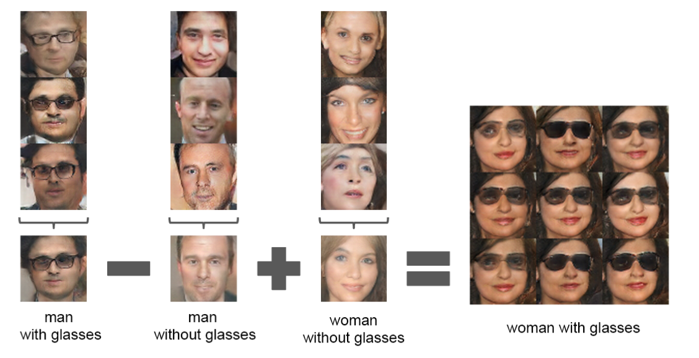
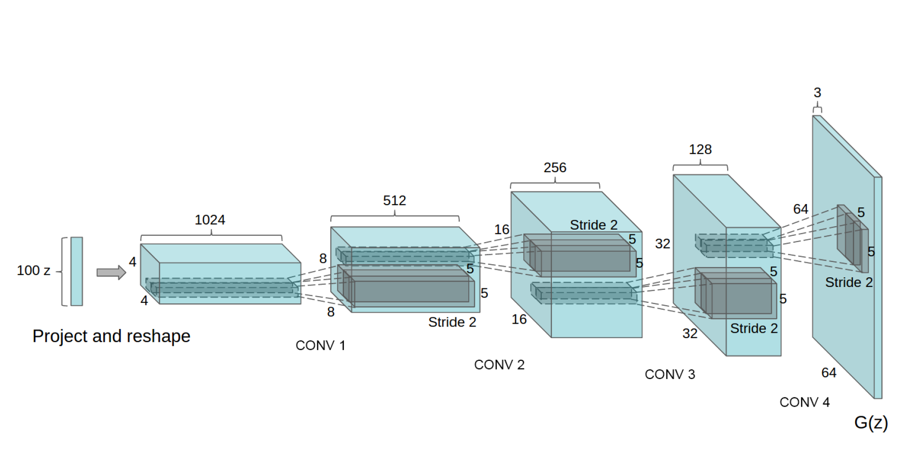

# DCGAN(Unsupervised Representation Learning with Deep Convolutional Generative Adversarial Networks)
Radford, A., Metz, L., & Chintala, S. (2015). Unsupervised representation learning with deep convolutional generative adversarial networks. arXiv preprint arXiv:1511.06434.

---

2016에 Alec Radford 등이 ICLR에 발표한 DCGAN은 많은 GAN 연구의 기초가 되고 있다. 기존 GAN은 학습이 어려운 단점을 가지고 있는데 DCGAN에서 안정적으로 학습할 수 있는 모델 구조를 제안했다. 

기존 GAN 모델의 경우 아주 간단하게 Fully-Connected된 모델 구조로 되어 있다. 다양한 연구에서 GAN에 CNN을 결합하려는 움직임이 있었지만 성공적이지 못했다. 논문에서 저자는 무수한 모델 탐색과 실험 끝에 다양한 데이터 셋에 안정적인 학습과 더 깊은 모델을 학습할 수 있는 GAN 아키텍처를 발견했다. 

저자가 발견한 안정적인 GAN 학습 구조는 아래와 같다. 

> ## Architecture guidelines for stable Deep Convolutional GANs
> -  Replace any pooling layers with strided convolutions (discriminator) and fractional-strided convolutions (generator).
> -  Use batchnorm in both the generator and the discriminator.
> -  Remove fully connected hidden layers for deeper architectures.
> -  Use ReLU activation in generator for all layers except for the output, which uses Tanh.
> - Use LeakyReLU activation in the discriminator for all layers.
> ## Generator
> - Transposed Convolution(fractional-strided convolutions) layer 를 사용한다.
> - 마지막 출력 레이어에는 Batch Normailzation을 사용하지 않는다. (출력 안정성을 높이기 위해)
> - Than 활성화 함수를 사용하는 마지막 레이어를 제외하고 모든 레이어에는 ReLU 활성화 함수를 사용한다. 
> ## Discriminator
> - Pooling 대신 Strided Convolution를 사용한다.
> - 첫 번째 레이어(입력 레이어) 및 마지막 레이어에는 Batch Normailzation을 사용하지 않는다. (출력 안정성을 높이기 위해)
> 활성화 함수는 Leaky ReLU를 사용한다. 


DCGAN을 통해 알아낸 것은 
- convolution의 각 필터는 영상의 특정 정보를 갖고 있다. 논문에서 사용한 침실 데이터를 확인하면 어떤 필터는 창문에 대한 정보를 가진 식으로 영상에서 특정 정보를 필터가 가지고 있다. 
- 입력으로 사용되는 노이즈는 생성될 이미지의 특징을 결정하는 벡터다. 논문에서는 노이즈 벡터의 연산을 통해 생성되는 이미지를 조절해 원하는 이미지를 생성해낸다. 




## Model 

DCGAN의 생성자 모델 구조는 다음과 같다. 
- 100 차원의 noise vector (latent vector)를 사용
- 각 레이어의 출력 차원은 1024 -> 512 -> 256 -> 128 -> 3
- 각 레이어의 출력 헤상도는 4^2 -> 8^2 -> 16^2 -> 32^2 -> 64^2



생성자 모델의 구조를 코드로 나타내면 아래의 코드와 같다. 
```python
class Generator(nn.Module):
    def __init__(self, z_dim, channels_img, dim=64):
        super(Generator, self).__init__()
        self.net = nn.Sequential(

			# img: 4x4
            self._block(z_dim, dim * 16, 4, 1, 0), 
			# img: 8x8
            self._block(dim * 16, dim * 8, 4, 2, 1), 
            # img: 16x16
            self._block(dim * 8, dim * 4, 4, 2, 1), 
            # img: 32x32
            self._block(dim * 4, dim * 2, 4, 2, 1), 
			# Output: N x channels_img x 64 x 64
            nn.ConvTranspose2d(
                dim * 2, channels_img,
				kernel_size=4, stride=2, padding=1
            ),
			nn.Tanh(),
        )

    def _block(self, in_channels, out_channels, kernel_size, stride, padding):
        return nn.Sequential(
            nn.ConvTranspose2d(
                in_channels, out_channels,
                kernel_size, stride,
                padding, bias=False,),
            nn.BatchNorm2d(out_channels),
            nn.ReLU(),
        )

    def forward(self, x):
        return self.net(x)
```

DCGAN의 분류자는 생성자와 대칭되는 형태이며 코드로 나타내면 아래와 같다. 
- 각 레이어의 출력 차원은 64 -> 128 -> 256-> 512
- 첫 번째, 마지막 레이어는 Batch Normailzation을 사용하지 않는다. 
  
```python
class Discriminator(nn.Module):
    def __init__(self, channels_img, dim=64):
        super(Discriminator, self).__init__()
        self.disc = nn.Sequential(
            nn.Conv2d(
                channels_img, dim,
				kernel_size=4, stride=2, padding=1
            ),
            nn.LeakyReLU(0.2),

            self._block(dim * 1, dim * 2, 4, 2, 1),
            self._block(dim * 2, dim * 4, 4, 2, 1),
            self._block(dim * 4, dim * 8, 4, 2, 1),

            nn.Conv2d(dim * 8, 1, kernel_size=4, stride=2, padding=0),
        )

    def _block(self, in_channels, out_channels, kernel_size, stride, padding):
        return nn.Sequential(
            nn.Conv2d(
                in_channels,
                out_channels,
                kernel_size,
                stride,
                padding,
                bias=False,
            ),
            nn.BatchNorm2d(out_channels),
            nn.LeakyReLU(0.2),
        )

    def forward(self, x):
        return self.disc(x)
```

## Hyperparameters

```python
import torch

DEVICE = torch.device("cuda:0" if torch.cuda.is_available() else "cpu")
SEED = 2333

class DATASET_MNIST:
    CAT = 'mnist'
    DIR = 'dataset/'
    IMAGE_SIZE = 64
    IMAGE_CHANNELS = 1


class DATASET_CELABA(DATASET_MNIST):
    CAT = 'celaba'
    DIR = '' # 다운로드한 위치를 지정
    IMAGE_SIZE = 64
    IMAGE_CHANNELS = 3

# 학습에 사용할 데이터셋 
# DATASET_MNIST or DATASET_CELABA를 사용하며 celaba 데이터는 추가로 다운로드해서 사용한다. 
DATASET = DATASET_MNIST 
IMAGE_SIZE = DATASET.IMAGE_SIZE
IMAGE_CHANNELS = DATASET.IMAGE_CHANNELS

BATCH_SIZE = 128
# 입력 노이즈 차원 
NOISE_DIM = 100
# 생성자 차원 
GEN_DIM = 64
# 분류자 차원 
DISC_DIM = 64
NUM_EPOCHS = 5

# optimizer 는 Adam 을 사용
# lr, beta는 논문과 같은 값을 사용했다. 
LEARNING_RATE = 2e-4
BETAS = (0.5, 0.999)

LOG_INTERVAL = 10
TEST_INTERVAL = 100

```

