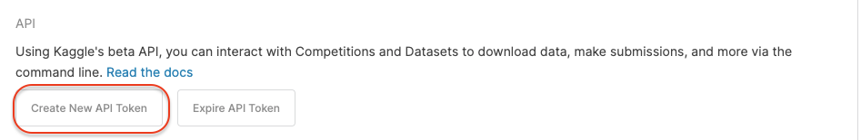
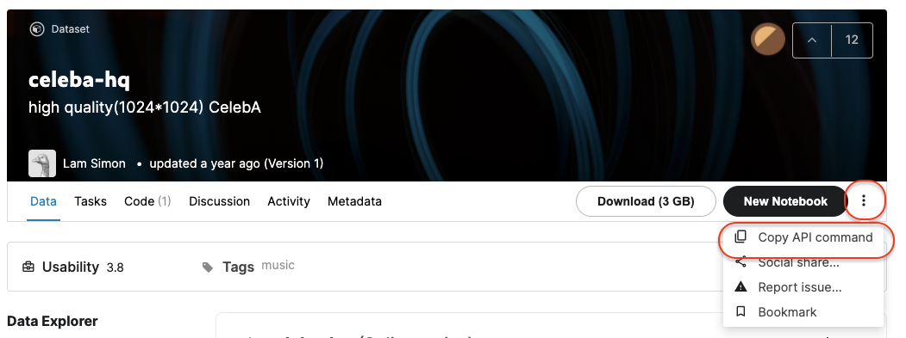

# Kaggle API Install

## [Install Kaggle API](https://github.com/Kaggle/kaggle-api)

- You need Python3 and pip 
- Copy and run command
```bash
pip install kaggle --upgrade
```

- login kaggle and Download Kaggle API Token
  - Click profile icon(top right)-> Account
  - Click "Create New API Token" in Acoount -> API Section 
  - Download kaggle.json (Kaggle API Token)


```json
// kaggle.json (Kaggle API Token) is similar to this
{"username":"{USERNAME}","key":"################################"}
```
- API token move to ~/.kaggle/
- Check kaggle API
```bash 
you@server:~$ kaggle --version 
Kaggle API 1.5.12
```

## Download Dataset using Kaggle API 

- Download target dataset : https://www.kaggle.com/lamsimon/celebahq

- Click "Copy API command"


- Run Script "kaggle datasets downaload -d {DATASET}"
``` bash 
you@server:~$ kaggle datasets download -d lamsimon/celebahq
Downloading celebahq.zip to /Users/yslee/Downloads
  2%|█           | 52.0M/2.55G [00:05<03:50, 11.6MB/s]
```
  
