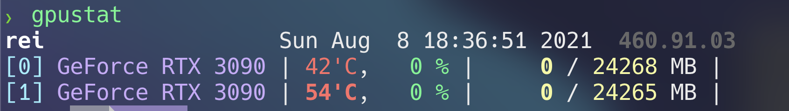
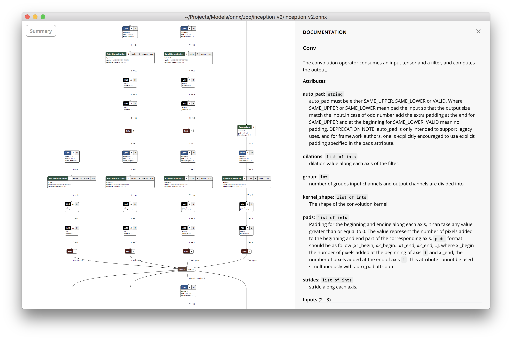

# GPU Monitering Tools 


## 1. [gpustat](https://pypi.org/project/gpustat/)

**Install**
```bash
pip install gpustat 
```

**RUN**
```bash
you@server:~$ gpustat
```



## 2. [gmonitor](https://github.com/mountassir/gmonitor)

[Install](https://github.com/mountassir/gmonitor#building-from-source)


**RUN**
```bash
you@server:~$ gmonitor
```


## 3. [glance](https://github.com/nicolargo/glances)

**Install**
```bash
pip install glances[gpu]
```

**RUN**


# Neural Network Visualizer

## 1. [netron](https://github.com/gaussian37/netron)

**Install**

[Downlaod From repo](https://github.com/gaussian37/netron#install)

**RUN**


## 2. [torchsummary](https://github.com/sksq96/pytorch-summary)

**Install**
```bash
pip install torchsummary
```
   
**RUN**
```python
import torch
from torchsummary import summary

class Net(nn.Module):
	...
model = Net()
summary(model, (1, 28, 28))
'''
----------------------------------------------------------------
        Layer (type)               Output Shape         Param #
================================================================
            Conv2d-1           [-1, 10, 24, 24]             260
            Conv2d-2             [-1, 20, 8, 8]           5,020
         Dropout2d-3             [-1, 20, 8, 8]               0
            Linear-4                   [-1, 50]          16,050
            Linear-5                   [-1, 10]             510
================================================================
Total params: 21,840
Trainable params: 21,840
Non-trainable params: 0
----------------------------------------------------------------
Input size (MB): 0.00
Forward/backward pass size (MB): 0.06
Params size (MB): 0.08
Estimated Total Size (MB): 0.15
----------------------------------------------------------------
'''
```

## 3. [torchinfo](https://github.com/TylerYep/torchinfo)

**Install**
```bash
pip install torchinfo
```

**RUN**
```python
from torchinfo import summary

model = ConvNet()
summary(model, input_size=(16, 1, 28, 28))
'''
================================================================================================================
Layer (type:depth-idx)          Input Shape          Output Shape         Param #            Mult-Adds
================================================================================================================
SingleInputNet                  --                   --                   --                  --
├─Conv2d: 1-1                   [7, 1, 28, 28]       [7, 10, 24, 24]      260                1,048,320
├─Conv2d: 1-2                   [7, 10, 12, 12]      [7, 20, 8, 8]        5,020              2,248,960
├─Dropout2d: 1-3                [7, 20, 8, 8]        [7, 20, 8, 8]        --                 --
├─Linear: 1-4                   [7, 320]             [7, 50]              16,050             112,350
├─Linear: 1-5                   [7, 50]              [7, 10]              510                3,570
================================================================================================================
Total params: 21,840
Trainable params: 21,840
Non-trainable params: 0
Total mult-adds (M): 3.41
================================================================================================================
Input size (MB): 0.02
Forward/backward pass size (MB): 0.40
Params size (MB): 0.09
Estimated Total Size (MB): 0.51
================================================================================================================

'''
```

