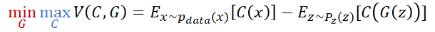

# Wasserstein GAN
Arjovsky, M., Chintala, S., & Bottou, L. (2017, July). Wasserstein generative adversarial networks. In International conference on machine learning (pp. 214-223). PMLR.


---

GAN의 문제점은 분류자와 생성자의 균형을 유지하며 학습하기 어렵고, 학습이 완료된 이후에 mode dropping(collapsing)이 발생한다는 점이다. 문제가 발생하는 이유는, 분류자가 역할을 충분히 해 주지 못해 모델이 최적점까지 학습되지 못했기 때문이라고 한다. 

> Mode란 최빈값으로 데이터 분포에서 관측치가 높은 부분을 의미함, 정규분포에서 평균이 분포의 mode다. 


*[출처 : deeplearning.ai "Build Basic Generative Adversarial Networks (GANs)" 강의자료]*

> Mode Collapse(모드 붕괴)란 BCE loss를 사용할 때 생기는 문제 중 하나이며, 생성자가 다양한 이미지를 만들어내지 못하고 최빈값과 유사한 데이터만 계속 생성하는 경우를 의미한다. 이는 생성자가 분류자를 속일 수 있는 소수의 샘플을 발견할 때 발생한다. 따라서 소수의 샘플만으로 분류자를 속일 수 있으므로 다른 샘플을 생성하지 못하고 생성자가 Local Minimum에 빠지게 된다.  


*[출처 : deeplearning.ai "Build Basic Generative Adversarial Networks (GANs)" 강의자료]*


저자는 GAN의 mode collapse를 개선하기 위해 새로운 loss **Wasserstein(와서스테인) loss** 를 사용한다. WGAN은 Wasserstein loss를 위해 기존에 사용하는 판별자(Discriminator) 대신 비평자(Critic)를 사용한다. 

Discriminator는 진짜/가짜를 판별하기 위해 sigmoid를 사용하고 출력은 가짜/진짜에 대한 예측 확률값이다. 반면 critic은 EM(Marth Mover) distance로 확률 분포 간의 거리를 측정하는 방식을 사용한 Scalr 값을 이용한다. 

Discriminator는 학습이 진행되어 Discriminator가 좋아짐에 따라 두 분포의 차이가 심해져서 loss의 기울기가 0 인 영역에 위치해 vanising gradient(기울기 손실)가 생긴다는 문제가 있다. 하지만 EM distance의 결과는 0과 1의 한계가 없다. 분포가 얼마나 멀리 떨어져 있든 상관없이 의미 있는 0이 아닌 gradient를 전달할 수 있다. 


*[출처 : deeplearning.ai "Build Basic Generative Adversarial Networks (GANs)" 강의자료]*


WGAN의 학습 과정은 아래와 같다. 특이한 점으로는 n_critic 번 비평자를 반복 학습 시키는 점과 *Adam* 대신 *RMSProp* optimizer를 사용한다는 것이다. critic을 학습할 때 Adam과 같은 mometum base optimizer(NAG, Nadam, Adam 등)를 사용하면 학습이 불안정하다고 한다.


*[출처 : Alorithm 1 WGAN "Wasserstein GAN" PAPER]*


## LOSS
EM distance를 수식으로 나타내면 아래와 같다.


EM distance는 출력이 제한되지 않지만, 신경망에서 사용하기 위해 Lipschitz 제약을 만족해야 한다. Lipschitz 조건이란, 두 점 사이의 거리를 일정 비 이상으로 증가시키지 않는 함수를 말한다. ([Lipschitz continuous 설명](https://ko.wikipedia.org/wiki/%EB%A6%BD%EC%8B%9C%EC%B8%A0_%EC%97%B0%EC%86%8D_%ED%95%A8%EC%88%98)) Lipschitz 조건을 만족시키기 위해 critic weight(parameter)에 clipping을 사용한다. 

WGAN loss를 코드로 나타내면 아래와 같다. 원논문과 같이 critic을 반복적으로 학습시키고 Lipschitz 조건을 위해 critic weight에 clipping을 걸어준다. 

```python
...

# Train Critic 
for _ in range(hp.CRITIC_ITERATIONS):
	fake = self.gen(noise)
	disc_real = self.critic(real).reshape(-1)
	disc_fake = self.critic(fake.detach()).reshape(-1)

	loss_critic = -(torch.mean(disc_real) -
					torch.mean(disc_fake))

	# UPDATE

	# weight clipping for Lipschitz-continuous
	for p in self.critic.parameters():
		p.data.clamp_(-hp.WEIGHT_CLIP, hp.WEIGHT_CLIP)

# Train Generator
output = self.critic(fake).reshape(-1)
lossG = -torch.mean(output)
# UPDATE
...
```


## MODEL

WGAN 학습에 사용하는 모델은 DCGAN과 동일한 모델을 사용하되 Critic(Discriminator) 마지막 레이어의 Sigmoid layer를 제거한다. 코드로 나타내면 아래와 같다. 

```python
class Critic(nn.Module):
    def __init__(self, channels_img, dim):
        super(Critic, self).__init__()
        self.disc = nn.Sequential(
            nn.Conv2d(
                channels_img, dim,
                kernel_size=4, stride=2, padding=1
            ),
            nn.LeakyReLU(0.2),

            self._build_block(dim * 1, dim * 2, 4, 2, 1),
            self._build_block(dim * 2, dim * 4, 4, 2, 1),
            self._build_block(dim * 4, dim * 8, 4, 2, 1),

            nn.Conv2d(dim * 8, 1, kernel_size=4, stride=2, padding=0),
        )

    def _build_block(self, in_channels, out_channels, kernel_size, stride, padding):
        return nn.Sequential(
            nn.Conv2d(
                in_channels,
                out_channels,
                kernel_size,
                stride,
                padding,
                bias=False,
            ),
            nn.InstanceNorm2d(out_channels, affine=True),
            nn.LeakyReLU(0.2),
        )

    def forward(self, x):
        return self.disc(x)
```

```python
class Generator(nn.Module):
    def __init__(self, z_dim, channels_img, dim):
        super(Generator, self).__init__()
        self.net = nn.Sequential(

            self._build_block(z_dim, dim * 16, 4, 1, 0),  # img: 4x4
            self._build_block(dim * 16, dim * 8, 4, 2, 1),  # img: 8x8
            self._build_block(dim * 8, dim * 4, 4, 2, 1),  # img: 16x16
            self._build_block(dim * 4, dim * 2, 4, 2, 1),  # img: 32x32
            nn.ConvTranspose2d(
                dim * 2, channels_img, kernel_size=4, stride=2, padding=1
            ),  # Output: N x channels_img x 64 x 64
            nn.Tanh(),
        )

    def _build_block(self, in_channels, out_channels, kernel_size, stride, padding):
        return nn.Sequential(
            nn.ConvTranspose2d(
                in_channels,
                out_channels,
                kernel_size,
                stride,
                padding,
                bias=False,
            ),
            nn.BatchNorm2d(out_channels),
            nn.ReLU(),
        )

    def forward(self, x):
        return self.net(x)
```

## Hyperparameters
```python 
# DCGAN Hyperparameters 동일
...
# optimizer 는 RMSProp을 사용
NUM_EPOCHS = 5
LEARNING_RATE = 5e-5
# critic 학습 횟수 
CRITIC_ITERATIONS = 5

# Lipschitz 조건을 위한 CLIPPING value
WEIGHT_CLIP = 0.01
...
```

